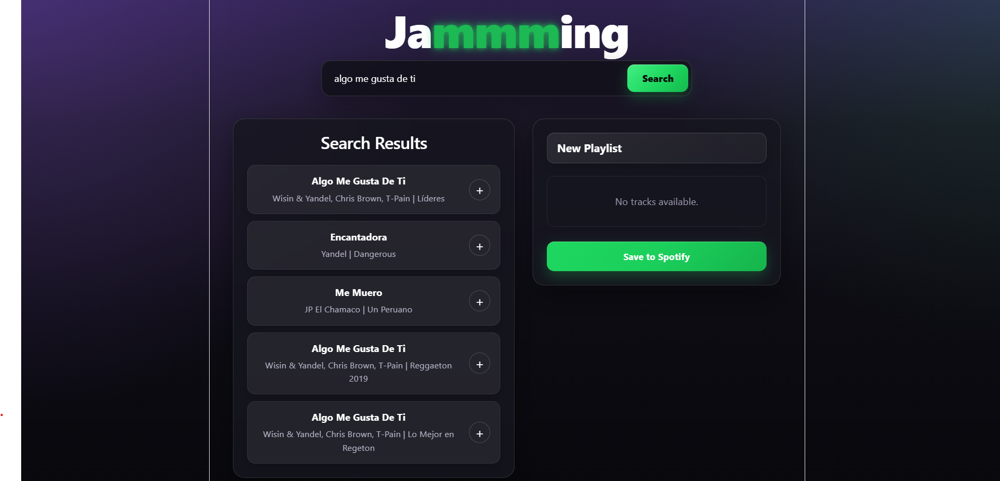

## 🎵 Jammming

Jammming is a React application that allows users to search for songs on Spotify and create custom playlists that can be saved directly to their Spotify account.

## 📸 Screenshot



## ✨ Features

- 🔍 Search songs using the Spotify Web API
- ➕ Add songs to a custom playlist
- ➖ Remove songs from a playlist
- ✏️ Rename playlists
- 💾 Save playlists directly to Spotify
- 🔐 Spotify OAuth 2.0 PKCE Authentication

## 🛠️ Technologies

- React
- Vite
- JavaScript (ES6+)
- CSS3
- Spotify Web API
- OAuth 2.0 PKCE

## ⚙️ Installation

```bash
npm install
npm run dev
```

## 🚀 Future Improvements

- Loading animation while searching and saving
- Multiple playlist support
- Playlist cover images
- Improved responsive design
- Audio preview for tracks

## 🤖 AI Assistance

AI was used as a learning, debugging, and documentation tool during the development of this project. All features were reviewed, tested, and integrated while learning the

## 📄 License

This project was created for educational purposes as part of my React learning journey.underlying concepts.

## 👨‍💻 Author

**Miguelangel Cardona**
